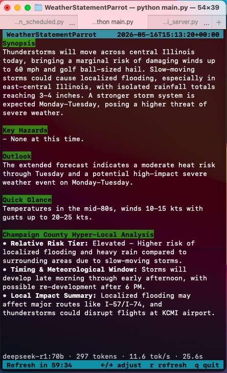

# WeatherStatementParrot 🦜⛈️

WeatherStatementParrot is a full-terminal, curses-based User Interface (TUI) for NOAA weather analysis. It fetches local weather statements and automatically feeds them into a local or remote Large Language Model (LLM) to extract insights, key hazards, and structured summaries, displaying them in a beautiful, dynamic terminal dashboard.



## Features

- **Automated Weather Fetching:** Automatically pulls the latest weather forecast discussions and statements from the NOAA API on a scheduled interval.
- **AI-Powered Insights:** Uses any OpenAI-compatible API to parse the dense meteorological text and extract:
  - Concise regional synopses
  - Key hazard bullet points
  - Hyper-local analyses (configurable via `.env`)
  - Extended outlooks
- **Dynamic Terminal UI:** 
  - Real-time countdown timer to the next refresh.
  - Interactive scrolling and timer adjustments.
  - A bottom-bar performance indicator tracking LLM generation speed and token counts.
- **Rich Text Rendering:** Parses LLM Markdown output natively in the terminal!
  - `*` list items are rendered as clean bullet points `•`.
  - `**bold**` text is dynamically highlighted inline.
  - `#`, `##`, and `###` headers are distinctly highlighted with cool, non-jarring colors.

## Getting Started

1. **Clone the repository:**
   Ensure you have Python 3.9+ installed.
2. **Install dependencies:**
   ```bash
   pip install -r requirements.txt
   ```
3. **Configure your environment:**
   Copy `.env.example` to `.env` and fill in your NOAA endpoint and OpenAI-compatible API credentials.
   ```bash
   cp .env.example .env
   ```
4. **Run the Parrot:**
   ```bash
   ./main.py
   ```

## Controls

- `←` / `→` : Decrease/Increase the fetch interval (15-minute increments).
- `↑` / `↓` : Scroll the parsed weather statement up and down. (Works seamlessly with your mouse wheel!)
- `r` : Force an immediate fetch and refresh.
- `q` : Quit the application.

## Configuration (`.env`)

You can customize the prompt instructions using the `EXTRA_PROMPT` variable. This allows you to command the LLM to look for specific hyper-local impacts, specific aviation identifiers, or custom data points without modifying the underlying Python code.
